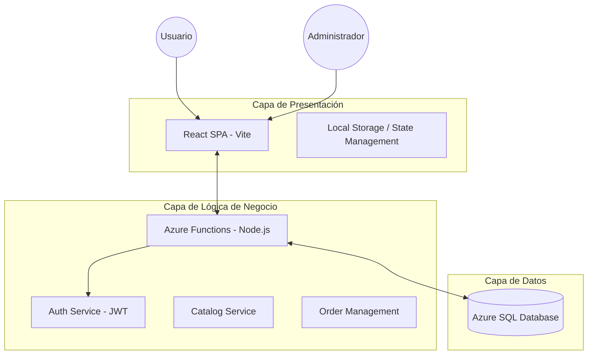

# Arquitectura del Sistema - MerCarlos

MerCarlos es una plataforma de comercio electrónico diseñada con una arquitectura de tres capas, optimizada para despliegues en la nube (Azure) y enfocada en la escalabilidad y mantenibilidad.

## Visión General

El sistema sigue un modelo de cliente-servidor moderno donde el frontend es una Single Page Application (SPA) y el backend es un conjunto de funciones serverless (FaaS).

## Stack Tecnológico

### Frontend
- **Framework**: React 19
- **Build Tool**: Vite
- **Routing**: React Router DOM 7
- **Styling**: Vanilla CSS (CSS Modules-like approach)
- **Icons**: Lucide React
- **HTTP Client**: Axios

### Backend
- **Runtime**: Node.js
- **Framework**: Azure Functions (v4)
- **Base de Datos**: Azure SQL / SQL Server
- **ORM/Driver**: `mssql`
- **Autenticación**: JWT (JSON Web Tokens)
- **Procesamiento**: `csv-parser` para carga masiva de inventario

## Componentes de la Arquitectura

### 1. Frontend (Capa de Presentación)
La interfaz de usuario está construida para ser responsiva y "mobile-first". Maneja:
- **Selección de Tienda**: Flujo inicial obligatorio para filtrar el catálogo según ubicación.
- **Carrito de Compras**: Persistencia local para asegurar que el usuario no pierda sus productos entre sesiones.
- **Gestión de Sesión**: Almacenamiento seguro de tokens JWT.

### 2. Backend (Servicios Serverless)
Implementado mediante Azure Functions, lo que permite un escalado automático y costos optimizados. Los servicios están desacoplados por funcionalidad:
- **Auth**: Maneja el registro y login (simulación de SMS OTP).
- **Catalog**: Gestiona la visualización de productos, precios por unidad y filtros.
- **Orders/Lists**: Maneja la creación de pedidos y listas de compra frecuentes.
- **Admin**: Funciones privilegiadas para la carga de CSV y gestión de precios.

### 3. Capa de Datos
Utiliza una base de Datos Relacional (SQL Server) para garantizar la integridad referencial, especialmente crítica en la gestión de inventarios y pedidos.

## Flujo de Datos Principal

1. **Consulta de Productos**: 
   - El cliente solicita productos enviando `cityId` y `sectorId`.
   - El backend consulta la BD aplicando filtros geográficos.
   - El backend calcula el PUM (Precio por Unidad de Medida) antes de responder.
   
2. **Proceso de Compra**:
   - El carrito se gestiona en el cliente.
   - Al finalizar, se envía a la función `orders`, que valida stock y registra la transacción.
   - Se devuelve una confirmación al usuario.

3. **Carga Administrativa**:
   - El admin sube un CSV.
   - La función `admin` procesa el stream del archivo, valida los datos y realiza un `bulk insert/update` en la base de datos.
